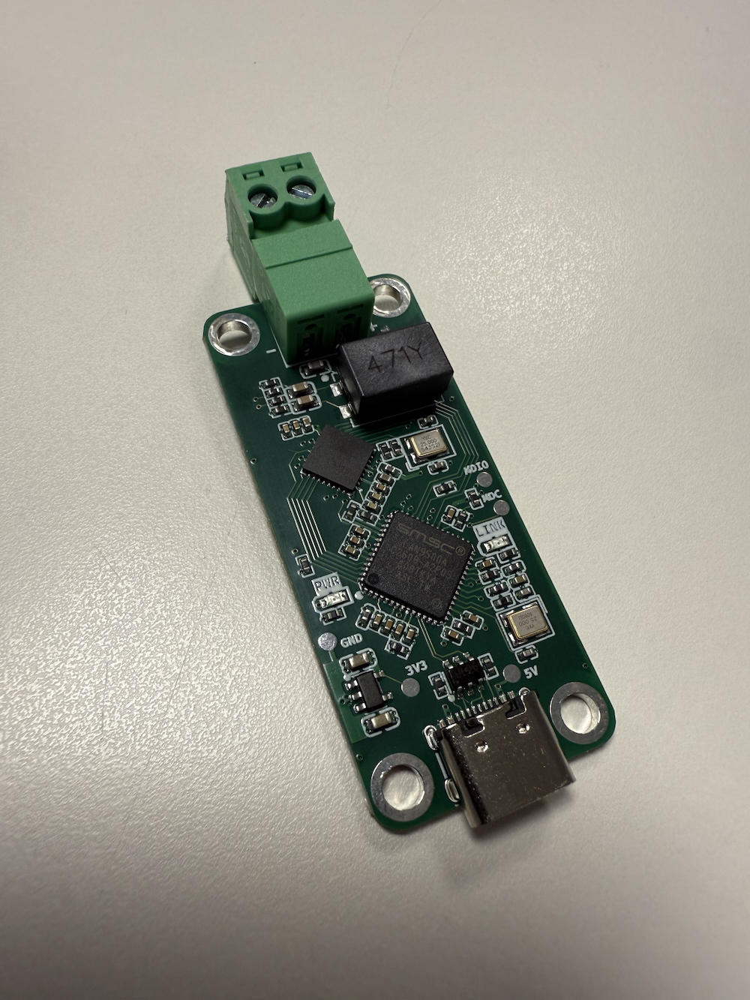
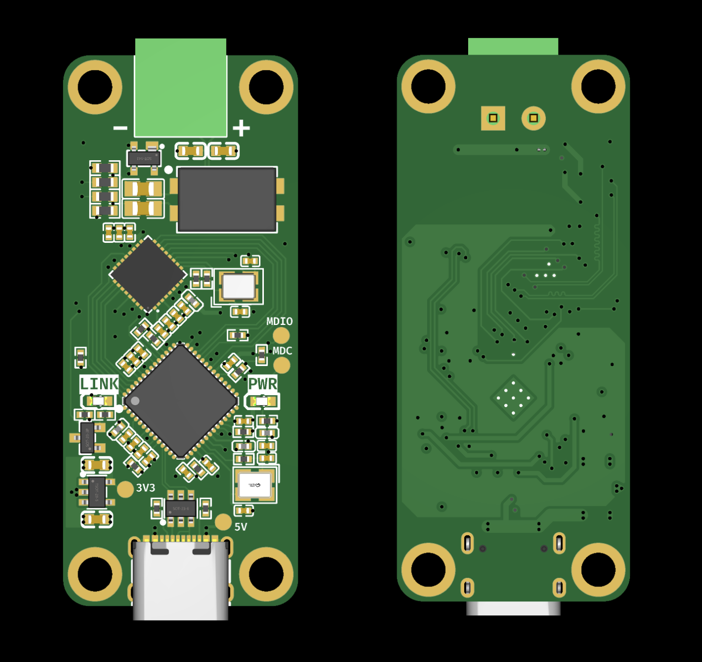
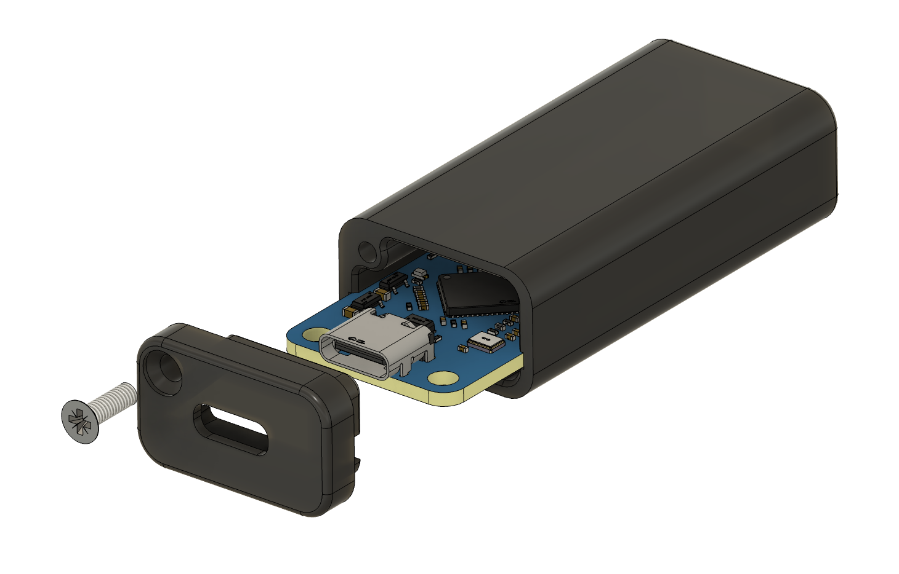

# Single Pair Ethernet 10BASE-T1L USB adapter

A USB ↔ SPE 10BASE-T1L adapter: plug it into any Linux host and get a
standard network interface that speaks Ethernet over a single twisted pair
(long-reach, up to ~1 km, 10 Mbit/s full-duplex). An easy way to give
a laptop, a Raspberry Pi, or an embedded SoC an SPE T1L port for bring-up and
diagnostics.



## Main components

| Part | Function | Datasheet |
|---|---|---|
| Microchip LAN9500A | USB 2.0 ↔ Ethernet MAC | [product page](https://www.microchip.com/en-us/product/lan9500a) |
| TI DP83TD510E | 10BASE-T1L PHY | [product page](https://www.ti.com/product/DP83TD510E) |

The LAN9500A runs in external PHY (MII) mode: its internal 100M PHY is
bypassed and the MII bus drives the DP83TD510E.



## Changelog - Rev 1

- Changed the SPE 24V TVS to a low-cap Ethernet part (`PESD2ETH-AX`) and moved it to
  the PHY side of the CMC for better DP83TD510E front-end protection.
- Updated the termination R/C parts to full 100 V-rated parts for better
  PoDL/cable-fault withstand margin.
- Reworked the cable-side routing, including a copper keepout under the cable
  area up to the CMC (NXP guidelines for UTP).
- Moved LINK LED control from the LAN9500A (unsupported in external PHY mode) to the DP83TD510E.
- Swapped PWR/LINK LED placement to simplify routing.
- Board size is now **51.5 × 22 mm** (Rev 0 was 50 × 22 mm).

## Enclosure

A 3D-printable case STEP model is provided for each of the hardware revisions. It needs a single ⌀2.5×8 mm flat head screw (Plastite or sheet metal/self-tapping screw) to attach the USB-side cap.



## Fabrication

Turnkey at JLCPCB. Import the EasyEDA Pro project, then order PCB + assembly in one shot. 

Rev 1 is also provided as a KiCad project in [`hw_rev1/kicad/`](hw_rev1/kicad/) (KiCad v9.0.7).

**4-layer PCB**: select the `JLC04161H-3313` stackup. The impedance-sensitive 
nets (USB-C D±, the MII bus, the T1L pair) are designed against that specific stackup.

## How it appears to Linux

Two chips, two drivers:

| Chip | Role | Linux driver | Notes |
|---|---|---|---|
| Microchip LAN9500A | USB 2.0 Ethernet MAC | `smsc95xx` | In mainline since forever, same family as the Raspberry Pi's own NIC. Works out of the box. |
| TI DP83TD510E | 10BASE-T1L PHY | `dp83td510` | In mainline since Linux 5.19, but **not always enabled** by distro kernels. Without it the link won't come up. |

When you plug the dongle in, `smsc95xx` enumerates and creates an interface
(`eth0`, `eth1`, … called `ethN` below). The MDIO scan finds the DP83TD510E
at address 0 (PHY ID `0x2000.0181`). **The PHY driver must be present**, or the
PHY falls back to *Generic PHY* and the T1L link never establishes.

> Quick identity check: `lsusb` should show VID `0424` / PID `9e00`.

## OS / driver support

| Host | `smsc95xx` (MAC) | `dp83td510` (PHY) | What to do |
|---|---|---|---|
| **Recent Ubuntu / Debian** (kernel ≥ 6.x) | usually built-in | usually built-in | Works out of the box when the PHY driver is enabled. Cable test (`ethtool --cable-test`) is kernel/driver-version dependent. |
| **Raspberry Pi OS** (Bookworm, ~6.x) | built-in | **absent** on the tested image | Build the PHY driver via DKMS (see below). Validated on Pi 3B+ / 6.12. |
| **Embedded target** (Buildroot / Yocto) | enable `CONFIG_USB_NET_SMSC95XX` | enable `CONFIG_DP83TD510_PHY` | Confirmed working from kernel **6.1 up** with the right driver/config in the BSP. Cable-test support is version-dependent, see the note below. |

> **Cable test on embedded kernels: it depends.** `ethtool --cable-test` needs a
> recent enough `dp83td510`. The 6.1-era driver may predate it, but the driver has
> been updated upstream since, so whether it's there comes down to exactly what
> your BSP ships (YMMV; check case by case). Where it's missing, the TDR/ALCD
> sequence can be driven directly over MDIO instead of through `ethtool`.

### Enabling the PHY driver as DKMS

On stock Raspberry Pi OS (and any host whose kernel doesn't ship `dp83td510`),
build it out-of-tree as a DKMS module so it survives reboots and kernel
updates. See the [`install-dp83td510-dkms.sh`](install-dp83td510-dkms.sh) script
(tested on RPi 3B+, very likely working on RPi 4, TBC for RPi 5).

After installing, unplug and replug the dongle, the PHY binds at USB
enumeration. Then `dmesg | grep -i DP83TD510` should read
`... attached PHY driver` (not `Generic PHY`).

## Quick start - Bring up a link

10BASE-T1L is point-to-point: one end is **master** (drives the clock), the other
**slave**. The DP83TD510E supports BASE-T1 auto-negotiation (IEEE 802.3cg) and
the dongle defaults to **preferred slave** so against a gateway, switch or media
converter that is master, the roles resolve automatically and the dongle will
not try to take master.

On a managed host (NetworkManager, `dhcpcd`, `systemd-networkd`, ...), the
interface may already be up and configured when the dongle is plugged in. Check
first, then bring it up manually only if it is still down:

```sh
ip link show ethN
sudo ip link set ethN up   # only if the interface is still DOWN / unmanaged
ethtool ethN               # Link detected: yes, Speed 10Mb/s, Duplex Full
sudo dhclient ethN         # only if DHCP was not already handled
```

A working link reads `10baseT1L/Full` and `Link detected: yes`.

You only need to force a role when auto-negotiation can't settle it: two
dongles back to back (both default to slave), or a peer running with AN disabled
/ a fixed role you have to match:

```sh
sudo ethtool -s ethN master-slave forced-master   # or forced-slave, to match the peer
```

## Throughput sanity check

Bench test: `iperf3` between a Mac and a Linux target, through this dongle and a
WAGO 852-1705 gateway. TCP throughput is stable in both directions at about line
rate:

- **downlink:** ~9.4 Mbit/s effective, with 0 retransmits in the captured run.
- **uplink:** ~9.4 Mbit/s effective.

For a 10 Mbit/s T1L link, that's the expected ceiling once Ethernet/IP/TCP
overhead is counted.

## Diagnostics with stock tools

`ethtool` and [`phytool`](https://github.com/wkz/phytool) cover the essentials —
no project-specific software needed. `ethtool` ships with every distro; `phytool`
often isn't packaged (e.g. on Raspberry Pi OS), but it builds in seconds:

```sh
git clone https://github.com/wkz/phytool && make -C phytool
sudo cp phytool/phytool /usr/local/bin/   # or anywhere on your PATH
```

### Link, speed, master/slave

```sh
ethtool ethN
#   Speed: 10Mb/s
#   Duplex: Full
#   Supported link modes:   10baseT1L/Full
#   master-slave cfg: forced master      (or preferred slave)
#   Link detected: yes
```

### Reliable link status (PHY_STS)

The Clause-22 BMSR link bit is latch-low on this PHY and gives timing false
negatives. The robust source is the vendor `PHY_STS` register (Clause 22, reg
`0x10`), bit 0 = link up:

```sh
phytool read ethN/0/0x10        # bit0 set => link up
```

### Signal quality (SQI / MSE)

The DP83TD510E reports a Mean-Square-Error metric (MMD VEND2 `0x1F`, reg
`0xA85`); lower MSE = cleaner signal = higher SQI (0–7). Native Clause-45 access
returns `EOPNOTSUPP` on the `smsc95xx` MDIO bus, so read it the way the kernel
does, **Clause-22-indirect** via the MMD access registers (`0x0D`/`0x0E`):

```sh
phytool write ethN/0/0x0d 0x001f   # MMD_CTRL: function=address, devad=0x1F
phytool write ethN/0/0x0e 0x0a85   # MMD_DATA: register = MSE_DETECT
phytool write ethN/0/0x0d 0x401f   # MMD_CTRL: function=data, devad=0x1F
phytool read  ethN/0/0x0e          # -> MSE, e.g. 0x001b
```

Reference (good link, on the bench): MSE `0x001b` → SQI 7/7, SNR ≈ 35 dB. The
SQI thresholds live in the `dp83td510` driver / TI datasheet.

### Cable test (TDR / ALCD)

On a kernel whose `dp83td510` includes cable test (≥ 6.x):

```sh
ethtool --cable-test ethN
```

- **Link up** → ALCD reports cable **length**.
- **Link down** → TDR reports a **fault** (open / short) and a location.

> ⚠ **Distance is not trustworthy out of the box.** The fault *type* (open vs
> short) is reliable; the *distance* is raw and the kernel's ×100 scaling looks
> wrong at short range (it reports ~25 m for a meter-ish-long cable). Real distance
> needs per-cable calibration (TI app note SNLA364).

The raw-graph form (`--cable-test-tdr`) is not supported by this driver.

## License

Licensed under `CERN-OHL-P-2.0` (cf. LICENSE file)

© Pierre Jay 2026
